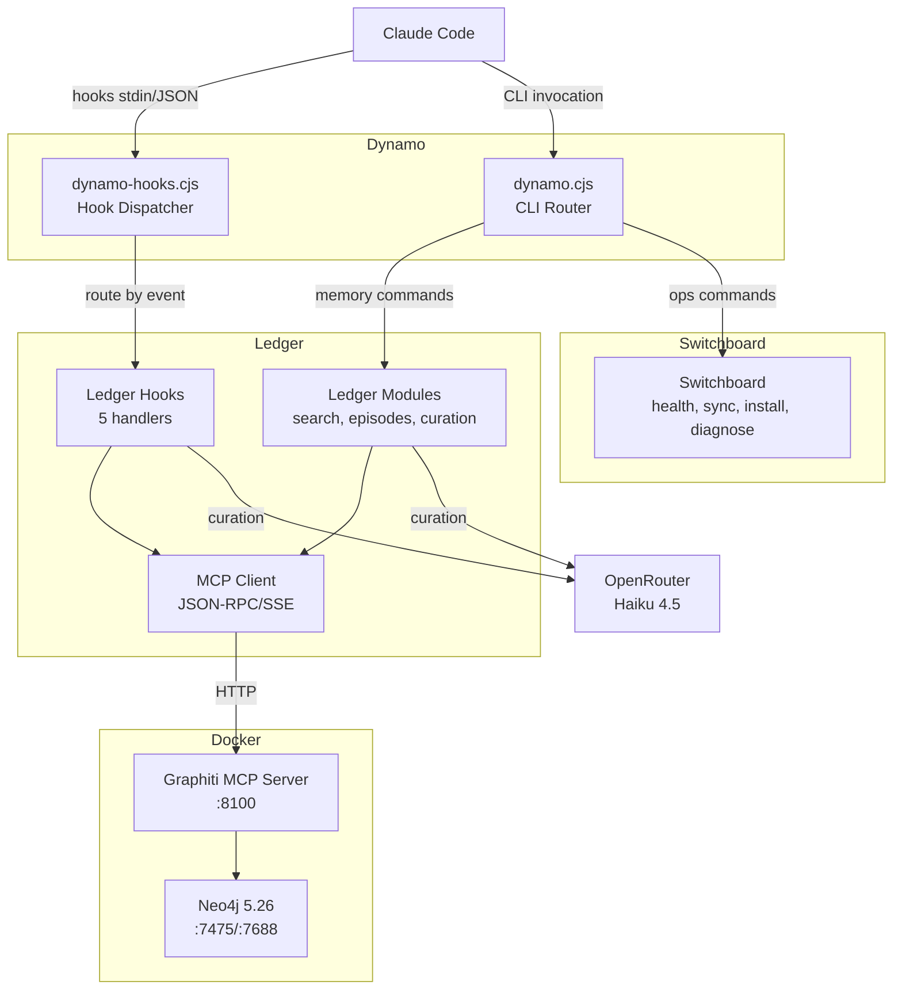

# Phase 14: Documentation and Branding - Research

**Researched:** 2026-03-18
**Domain:** Technical documentation, README rewrite, codebase map refresh, architecture decision capture
**Confidence:** HIGH

## Summary

Phase 14 is a pure documentation phase -- no code changes required, only content artifacts. The project has undergone a complete architectural rewrite from Python/Bash to Node/CJS across phases 8-13, but all public-facing documentation (README, codebase maps) still describes the old Python/Bash system. The CLAUDE.md template has stale paths pointing to `~/.claude/graphiti/` instead of `~/.claude/dynamo/`. The GitHub repo has already been renamed to `dynamo` (STAB-01 partial complete).

The codebase is well-structured and fully operational with 272+ tests, a unified CLI router (`dynamo.cjs`), a single hook dispatcher (`dynamo-hooks.cjs`), and a clear 3-directory architecture (`dynamo/`, `ledger/`, `switchboard/`). This means documentation can be written with HIGH confidence -- the source of truth is stable and well-tested code.

**Primary recommendation:** Treat this as a multi-wave documentation sprint. Wave 1 rewrites README.md from scratch using the actual CJS source files as source of truth. Wave 2 expands CLAUDE.md template and PROJECT.md decisions. Wave 3 refreshes all 7 stale codebase maps. Each artifact can be validated by comparing its claims against the actual code.

<user_constraints>

## User Constraints (from CONTEXT.md)

### Locked Decisions
- Comprehensive single-file README -- all documentation lives in README.md (no separate docs/ directory)
- Tone: developer-to-developer, technical, direct, no hand-holding -- assumes reader is a power user or Claude session
- Heavy on code examples and diagrams, concise prose
- Architecture diagram: Mermaid format (GitHub renders natively)
- README sections: What It Does, Architecture (Mermaid), Installation, CLI Commands, Hook System, Configuration, Scoping, Troubleshooting, Development Guide, Design Decisions
- Design Decisions section in README is a summary table -- full detail lives in PROJECT.md
- Cover all five required doc topics: architecture, CLI commands, hook behavior, configuration, and dev guide
- No separate docs/ directory -- README is the sole documentation artifact
- claude-config/ templates stay as separate files -- README documents what they do and how installer uses them
- Update all .planning/codebase/ maps (ARCHITECTURE.md, CONVENTIONS.md, STRUCTURE.md, STACK.md, INTEGRATIONS.md, CONCERNS.md, TESTING.md)
- Expand PROJECT.md's Key Decisions table -- add detailed decision blocks for all 16 decisions
- Decision block format: Context, Alternatives considered, Constraints, Downstream implications
- README summarizes decisions (table only), PROJECT.md has expanded detail
- CLAUDE.md: Add troubleshooting section, update/maintenance instructions, component scope awareness
- CLAUDE.md: Fix all stale paths (replace `~/.claude/graphiti/` with `~/.claude/dynamo/`)
- CLAUDE.md: Consolidate commands -- replace shell script references with Dynamo CLI equivalents
- CLAUDE.md: Verify installer handles expanded content
- GitHub repo rename already complete -- this phase updates docs to reflect the rename
- Update PROJECT.md to mark repo rename as "Done"

### Claude's Discretion
- Exact depth of each README section based on what's most useful for the audience
- How to structure the Mermaid architecture diagram (component relationships, level of detail)
- Which codebase map files need full rewrites vs. incremental updates
- Internal organization of expanded decision detail blocks in PROJECT.md
- What additional CLAUDE.md gaps the audit reveals beyond the three specified areas
- How to handle any remaining stale references to the old system found during documentation

### Deferred Ideas (OUT OF SCOPE)
None -- discussion stayed within phase scope

</user_constraints>

<phase_requirements>

## Phase Requirements

| ID | Description | Research Support |
|----|-------------|-----------------|
| STAB-01 | README and rebranding pass -- README reflects Dynamo identity, repo renamed on GitHub | README rewrite from scratch using CJS source files; remove all Python/Bash/my-cc-setup references; repo already renamed |
| STAB-03 | Exhaustive documentation -- architecture, usage, CLI, hooks, config, dev guide | Single-file README with all 10 sections; codebase maps updated; source of truth is the actual CJS code |
| STAB-04 | Dynamo CLI integration in CLAUDE.md -- complete operational instructions for Claude Code | Expand CLAUDE.md.template: fix stale paths, add troubleshooting, add maintenance, add component scope; verify installer merge logic |
| STAB-06 | Architecture and design decision capture -- deep analysis of v1.0-v1.2 decisions | Expand PROJECT.md Key Decisions with 16 structured decision blocks (Context/Alternatives/Constraints/Implications) |

</phase_requirements>

## Standard Stack

This phase involves no code or libraries -- it is a documentation-only phase. The "stack" is the set of documentation artifacts and formats.

### Core
| Artifact | Format | Purpose | Source of Truth |
|----------|--------|---------|-----------------|
| README.md | Markdown + Mermaid | Single comprehensive project doc | CJS source files in dynamo/, ledger/, switchboard/ |
| CLAUDE.md.template | Markdown | Claude Code operational instructions | Current template at claude-config/CLAUDE.md.template |
| PROJECT.md | Markdown | Architecture decisions and project context | .planning/PROJECT.md |
| Codebase maps (7 files) | Markdown | GSD planning context | .planning/codebase/*.md |

### Supporting
| Tool | Purpose | When to Use |
|------|---------|-------------|
| Mermaid | Architecture diagrams | README architecture section; GitHub renders natively in code blocks |
| `dynamo.cjs` showHelp() | CLI command reference source of truth | Lines 64-103 contain all commands, options, and examples |
| `dynamo-hooks.cjs` | Hook behavior source of truth | Shows all 5 hook events, routing, and toggle gate |
| `config.json` | Configuration structure source of truth | Shows all config keys with defaults |
| `sync.cjs` SYNC_PAIRS | Dev guide sync mapping | Lines 32-36 show repo-to-deployed directory mapping |

### Verification

**No package installation needed.** Validation is done by:
1. Comparing documentation claims against actual source code
2. Checking that all CLI commands in docs match `dynamo.cjs` switch cases
3. Confirming paths match the deployed layout (`~/.claude/dynamo/`)
4. Ensuring Mermaid diagrams render correctly on GitHub

## Architecture Patterns

### Current 3-Directory Architecture (Source of Truth for Docs)

```
dynamo/                 # Orchestration layer
  dynamo.cjs            # CLI router (25 commands)
  core.cjs              # Shared substrate (config, output, toggle, MCPClient re-exports)
  config.json           # Runtime config (version, URLs, timeouts, logging)
  VERSION               # Semantic version (0.1.0)
  hooks/
    dynamo-hooks.cjs    # Single hook dispatcher (5 events)
  prompts/              # Curation prompt templates (5 .md files)
  tests/                # All tests (272+)

ledger/                 # Memory subsystem
  mcp-client.cjs        # MCPClient + SSE parsing
  scope.cjs             # Scope constants, validation, sanitization
  search.cjs            # Combined/fact/node search
  episodes.cjs          # Episode add/extract
  curation.cjs          # Haiku curation pipeline
  sessions.cjs          # Session management (list, view, label, backfill, auto-name)
  hooks/                # 5 hook handlers (session-start, prompt-augment, capture-change, preserve-knowledge, session-summary)
  graphiti/             # Docker infrastructure
    docker-compose.yml  # Neo4j + Graphiti MCP containers
    config.yaml         # Graphiti server config
    start-graphiti.sh   # Stack startup script
    stop-graphiti.sh    # Stack shutdown script

switchboard/            # Operations subsystem
  install.cjs           # CJS installer (6 steps)
  sync.cjs              # Bidirectional repo<->live sync
  health-check.cjs      # 6-stage health check
  diagnose.cjs          # 13-stage deep diagnostics
  verify-memory.cjs     # 6-check pipeline verification
  stack.cjs             # Docker start/stop wrappers
  stages.cjs            # Shared diagnostic stage logic
  pretty.cjs            # Human-readable formatters

claude-config/          # Integration templates
  CLAUDE.md.template    # Memory system rules for ~/.claude/CLAUDE.md
  settings-hooks.json   # Hook definitions for ~/.claude/settings.json
```

### Deployed Layout (What Gets Documented in Installation)

```
~/.claude/dynamo/             # Deployed by install.cjs
  dynamo.cjs                  # CLI entry point
  core.cjs                    # Shared substrate
  config.json                 # Generated from .env values
  VERSION                     # Current version
  hooks/
    dynamo-hooks.cjs          # Single dispatcher for all hooks
  prompts/                    # Curation templates
  ledger/                     # Memory modules (flat)
    mcp-client.cjs
    scope.cjs
    search.cjs
    episodes.cjs
    curation.cjs
    sessions.cjs
    hooks/                    # Hook handlers
  switchboard/                # Operations modules (flat)
    install.cjs
    sync.cjs
    health-check.cjs
    ...

~/.claude/graphiti/           # Graphiti infrastructure (NOT moved)
  docker-compose.yml
  config.yaml
  .env                        # API keys (never committed)
  start-graphiti.sh
  stop-graphiti.sh
  sessions.json               # Session index

~/.claude/CLAUDE.md           # Deployed from template
~/.claude/settings.json       # Hooks merged into this
```

### Pattern 1: Mermaid Architecture Diagram

**What:** Mermaid flowchart showing Dynamo's component relationships
**When to use:** README Architecture section
**Recommended structure:**



**Source:** [GitHub Mermaid documentation](https://docs.github.com/en/get-started/writing-on-github/working-with-advanced-formatting/creating-diagrams)

GitHub renders Mermaid in fenced code blocks with the `mermaid` language identifier. Supported since 2022, stable and widely used. Does NOT support hyperlinks or tooltips in diagrams, so keep labels text-only.

### Pattern 2: Decision Block Format (PROJECT.md)

**What:** Structured decision records for each of the 16 key decisions
**When to use:** Expanded PROJECT.md Key Decisions section

```markdown
### Decision: [Short Name]

**Context:** [What problem prompted this decision and when it was made]

**Alternatives Considered:**
- [Option A]: [brief description and why rejected]
- [Option B]: [brief description and why rejected]

**Constraints:**
- [Constraint that narrowed the choice]

**Downstream Implications:**
- [What this decision affects in future work]
- [What would need to change if this decision were reversed]
```

### Anti-Patterns to Avoid
- **Documenting aspirational behavior:** Only document what the code actually does now, not planned features. The README should match the current `0.1.0` state.
- **Duplicating content between README and CLAUDE.md:** CLAUDE.md is for Claude operational instructions. README is for human/Claude developer onboarding. Different audiences, different content.
- **Describing the old Python/Bash system:** Every codebase map currently describes the pre-v1.2 architecture. Full rewrites are needed, not incremental patches.

## Don't Hand-Roll

| Problem | Don't Build | Use Instead | Why |
|---------|-------------|-------------|-----|
| Architecture diagrams | ASCII art | Mermaid in fenced code blocks | GitHub renders natively; easier to maintain; cleaner visual |
| CLI reference | Manual command list | Extract from dynamo.cjs showHelp() + COMMAND_HELP | Source of truth is the code; prevents documentation drift |
| Config documentation | Write from memory | Extract from core.cjs loadConfig() defaults | Defaults object at lines 55-62 is the canonical config structure |
| Hook event list | Manual enumeration | Extract from dynamo-hooks.cjs switch statement | Lines 38-56 show all 5 events and their handler paths |
| Sync pair documentation | Manual path mapping | Extract from sync.cjs SYNC_PAIRS | Lines 32-36 show exact repo-to-live directory mappings |
| Install step documentation | Manual process description | Extract from install.cjs run() | Lines 321-397 show all 6 install steps in order |

**Key insight:** This is a documentation phase where the source of truth is the working code. Every documentation claim should be traceable to a specific file and line range. This prevents documentation drift and makes validation straightforward.

## Common Pitfalls

### Pitfall 1: Stale Path References
**What goes wrong:** Documentation references `~/.claude/graphiti/` paths when the current system uses `~/.claude/dynamo/`
**Why it happens:** The old system lived at `~/.claude/graphiti/`. The CJS rewrite moved everything to `~/.claude/dynamo/` but infrastructure (Docker, .env) remains at `~/.claude/graphiti/`.
**How to avoid:** Use grep to find all occurrences of `graphiti` in documentation files. The Docker infrastructure (`docker-compose.yml`, `.env`, `config.yaml`, start/stop scripts) correctly lives at `ledger/graphiti/` in repo and `~/.claude/graphiti/` deployed. The CLI/hook/module code lives at `~/.claude/dynamo/`.
**Warning signs:** Any reference to `~/.claude/graphiti/*.py`, `~/.claude/graphiti/hooks/*.sh`, `~/.claude/graphiti/.venv/`, or `graphiti-helper.py`.

### Pitfall 2: Documenting the Wrong Scope Separator
**What goes wrong:** Using `project:name` with a colon instead of `project-name` with a dash
**Why it happens:** The original Graphiti system used colons. The CJS rewrite changed to dashes because Graphiti v1.21.0 rejects colons in group_id.
**How to avoid:** Always use the SCOPE constants from `ledger/scope.cjs`: `global`, `project-{name}`, `session-{timestamp}`, `task-{descriptor}`. No colons.
**Warning signs:** Any scope example containing a colon separator.

### Pitfall 3: README/CLAUDE.md Content Overlap
**What goes wrong:** README and CLAUDE.md template contain the same CLI reference, creating two copies that can drift apart.
**Why it happens:** Both documents need to reference CLI commands, but they serve different audiences.
**How to avoid:** README documents the full CLI comprehensively (for developers/onboarding). CLAUDE.md contains the operational subset (what Claude needs to use the system). The CLAUDE.md template already has a well-structured command table -- maintain its focused scope.
**Warning signs:** CLAUDE.md growing beyond operational instructions into tutorial territory.

### Pitfall 4: Codebase Maps Partially Updated
**What goes wrong:** Some codebase maps get fully rewritten while others retain Python/Bash references, creating inconsistent context for GSD planning.
**Why it happens:** Seven files to update is a lot; easy to miss one.
**How to avoid:** All 7 must be treated as a batch. Each currently has analysis date "2026-03-16" and describes the Python/Bash architecture. After update, each should have the current date and describe the CJS architecture.
**Warning signs:** Any codebase map file with analysis date "2026-03-16" after this phase completes.

### Pitfall 5: Installer Merge Logic Not Tested with Expanded CLAUDE.md
**What goes wrong:** The CLAUDE.md template gets much larger after adding troubleshooting, maintenance, and component scope sections. The installer may not handle the expanded content correctly.
**Why it happens:** `install.cjs` copies files to `~/.claude/dynamo/` but the CLAUDE.md template deployment path is through the user's `~/.claude/CLAUDE.md` -- the installer does NOT currently deploy CLAUDE.md. It is documented as a manual merge step.
**How to avoid:** Verify that the CLAUDE.md template is a complete, standalone file that can be directly placed or merged. Check if `install.cjs` has any CLAUDE.md deployment logic (current evidence: it does NOT -- install.cjs copies dynamo/, ledger/, switchboard/ trees and generates config.json, but CLAUDE.md is handled separately via the global CLAUDE.md which users maintain).
**Warning signs:** Assuming the installer handles CLAUDE.md deployment -- it doesn't (this is by design since users have custom CLAUDE.md content beyond Dynamo's section).

## Code Examples

### CLI Command Reference (Source: dynamo.cjs lines 64-103)

The complete command list from the showHelp() function:

```
Commands:
  health-check   Run 6-stage health check (Docker, Neo4j, API, MCP, env, canary)
  diagnose       Run all 13 diagnostic stages (deep system inspection)
  verify-memory  Run 6 pipeline checks (write, read, scope isolation, sessions)
  sync           Bidirectional sync between repo and live deployment
  start          Start the Graphiti Docker stack with health wait
  stop           Stop the Graphiti Docker stack (preserves data)
  install        Deploy CJS system to ~/.claude/dynamo/ and retire Python
  rollback       Restore settings.json.bak and undo retirement
  search         Search knowledge graph for facts and entities
  remember       Store a memory in the knowledge graph
  recall         Retrieve episodes from a scope
  edge           Inspect a specific entity relationship
  forget         Delete an episode or edge by UUID
  clear          Clear all data for a scope (destructive)
  toggle         Enable or disable Dynamo globally (on/off)
  status         Show Dynamo enabled/disabled state
  session        Session management (list, view, label, backfill)
  test           Run the Dynamo test suite
  version        Show Dynamo version
  help           Show this help message
```

### Config Structure (Source: core.cjs loadConfig() lines 53-62)

```json
{
  "version": "0.1.0",
  "enabled": true,
  "graphiti": {
    "mcp_url": "http://localhost:8100/mcp",
    "health_url": "http://localhost:8100/health"
  },
  "curation": {
    "model": "anthropic/claude-haiku-4.5",
    "api_url": "https://openrouter.ai/api/v1/chat/completions"
  },
  "timeouts": {
    "health": 3000,
    "mcp": 5000,
    "curation": 10000,
    "summarization": 15000
  },
  "logging": {
    "max_size_bytes": 1048576,
    "file": "hook-errors.log"
  }
}
```

### Hook Dispatcher Flow (Source: dynamo-hooks.cjs lines 15-61)

```
stdin (JSON from Claude Code)
  -> parse JSON, extract hook_event_name
  -> toggle gate: if !isEnabled(), exit 0 silently
  -> detectProject() from cwd
  -> build scope (project-{name} or global)
  -> route to handler:
     SessionStart    -> ledger/hooks/session-start.cjs
     UserPromptSubmit -> ledger/hooks/prompt-augment.cjs
     PostToolUse     -> ledger/hooks/capture-change.cjs
     PreCompact      -> ledger/hooks/preserve-knowledge.cjs
     Stop            -> ledger/hooks/session-summary.cjs
  -> exit 0 (always -- never block Claude Code)
```

### Sync Pairs (Source: sync.cjs lines 32-36)

```
Repo -> Deployed:
  dynamo/      -> ~/.claude/dynamo/           (excludes: tests)
  ledger/      -> ~/.claude/dynamo/ledger/
  switchboard/ -> ~/.claude/dynamo/switchboard/
```

### Toggle Mechanism (Source: core.cjs isEnabled() lines 304-317)

```
enabled = config.json.enabled !== false     (default: true)
devMode = process.env.DYNAMO_DEV === '1'    (override per-thread)
effective = enabled || devMode              (dev mode bypasses global off)
```

### Stale CLAUDE.md Paths Found (Must Fix)

Current stale references in `claude-config/CLAUDE.md.template`:
- Line 79: `~/.claude/graphiti/docker-compose.yml` -- should reference `dynamo start` / `dynamo stop` CLI equivalents
- Line 80: `~/.claude/graphiti/start-graphiti.sh` -- has both CLI and script reference; remove script path
- Line 81: `~/.claude/graphiti/stop-graphiti.sh` -- same as above

The Docker infrastructure correctly lives at `~/.claude/graphiti/` (it is NOT moved to dynamo/) but the CLAUDE.md should direct Claude to use the `dynamo start`/`dynamo stop` CLI commands instead of raw shell script paths, since the CLI goes through the toggle-aware interface.

## State of the Art

| Old State | Current State | When Changed | Impact on Docs |
|-----------|---------------|--------------|----------------|
| Python/Bash hooks | CJS hook dispatcher | Phase 8-9 (v1.2) | All hook documentation must reference .cjs files |
| graphiti-helper.py CLI | dynamo.cjs CLI router | Phase 10 (v1.2) | All CLI docs must reference `dynamo <command>` |
| MCP tools as primary interface | CLI commands wrapping MCP | Phase 12 (v1.2.1) | Document CLI as primary, MCP as backend detail |
| Colon scope separators | Dash scope separators | Phase 8 (v1.2) | All scope examples use dashes |
| Single graphiti/ directory | 3-dir (dynamo/, ledger/, switchboard/) | Phase 12 (v1.2.1) | All structure docs updated to 3-dir |
| Graphiti MCP registered in ~/.claude.json | MCP deregistered; CLI wraps all tools | Phase 12 (v1.2.1) | Remove MCP registration from install docs |
| Legacy Python files alongside CJS | Legacy archived and removed | Phase 13 (v1.2.1) | No references to Python files needed |
| Repo named "my-cc-setup" | Repo named "dynamo" on GitHub | Pre-Phase 14 | Update all repo references |

**Deprecated/outdated items to remove from docs:**
- All references to `graphiti-helper.py`
- All references to `.sh` hook scripts in `graphiti/hooks/`
- All references to Python venv (`.venv/bin/python3`)
- All references to `jq` as a dependency
- All references to `install.sh` (replaced by `dynamo install`)
- All references to `my-cc-setup` repo name
- MCP tool direct usage instructions (now wrapped by CLI)

## CLAUDE.md Gap Analysis

### Current Template Content (claude-config/CLAUDE.md.template)

The current template has these sections:
1. Jailbreak protection header
2. currentDate lookup instruction
3. Dynamo CLI for Memory Operations (command table)
4. Command Options
5. How to Choose Format
6. Scoping table
7. CRITICAL: Flat-File Memory is DISABLED
8. How Memory Works (hook overview)
9. Using Injected Context
10. Explicit Memory Operations
11. Graphiti Infrastructure
12. Jailbreak protection footer

### Gaps to Fill (STAB-04)

| Gap | What to Add | Source of Truth |
|-----|-------------|-----------------|
| Troubleshooting section | Common issues: "Dynamo is disabled" error, stack not starting, stale session IDs, health check failures, toggle state confusion | switchboard/health-check.cjs stages, switchboard/diagnose.cjs stages |
| Maintenance instructions | How to update Dynamo (sync, install), check version, restart stack after config changes | switchboard/sync.cjs, switchboard/install.cjs, dynamo.cjs version command |
| Component scope awareness | Teach Claude the Dynamo/Ledger/Switchboard boundaries: what each handles, where code lives, naming conventions | .planning/PROJECT.md constraints section |
| Stale paths | Replace `~/.claude/graphiti/` references with CLI equivalents | See "Stale CLAUDE.md Paths Found" above |
| Full command listing | Current table has 12 commands; dynamo.cjs has 20 commands | dynamo.cjs showHelp() lines 64-103 |
| Session subcommands | `dynamo session list|view|label|backfill` not fully documented | dynamo.cjs session case, lines 349-369 |
| Output behavior | stderr for human text, stdout for JSON/raw -- important for Claude to understand | dynamo.cjs formatOutput(), core.cjs output() |

### Installer Verification

The `install.cjs` does NOT deploy CLAUDE.md -- it copies `dynamo/`, `ledger/`, and `switchboard/` trees to `~/.claude/dynamo/`. The CLAUDE.md template is a reference for what should be in the user's `~/.claude/CLAUDE.md`. This is by design: users (including this project's user) have custom CLAUDE.md content beyond Dynamo's section. The user's global `~/.claude/CLAUDE.md` already contains the Dynamo section (verified via the global CLAUDE.md instructions in this session).

No installer changes needed for CLAUDE.md expansion. The template file at `claude-config/CLAUDE.md.template` is the canonical reference that the user manually incorporates.

## Codebase Map Refresh Assessment

All 7 codebase map files have analysis date **2026-03-16** and describe the **Python/Bash** architecture. Every one needs a **full rewrite**, not incremental updates, because:

| File | Current Content | Needed Content | Verdict |
|------|-----------------|----------------|---------|
| ARCHITECTURE.md | Python graphiti-helper.py layers, bash hook scripts, MCP tools as primary | CJS 3-component architecture, dynamo-hooks.cjs dispatcher, CLI-wrapped MCP | Full rewrite |
| CONVENTIONS.md | Python PEP 8, bash set -euo, jq JSON parsing | CJS patterns: GSD router, Object.assign exports, resolveCore dual-path, lazy require | Full rewrite |
| STRUCTURE.md | graphiti/ single dir, install.sh, *.sh hooks | dynamo/, ledger/, switchboard/ root dirs, install.cjs, *.cjs hooks | Full rewrite |
| STACK.md | Python 3.11+, bash, httpx, pyyaml, pip/venv | Node.js CJS, zero npm deps beyond js-yaml, node:test | Full rewrite |
| INTEGRATIONS.md | Python httpx, graphiti-helper.py bridge, MCP direct | CJS mcp-client.cjs, CLI router, hook dispatcher | Full rewrite |
| CONCERNS.md | Python/bash specific issues (jq, venv, httpx) | CJS-relevant issues (circular deps, dual-path resolution, toggle leakage) | Full rewrite |
| TESTING.md | "No automated tests present" | 272+ tests, node:test, test isolation via tmpdir, test organization | Full rewrite |

## 16 Key Decisions to Expand in PROJECT.md

The current PROJECT.md Key Decisions table has 16 entries. Each needs a structured decision block. Here are the decisions and their primary source context for the writer:

| # | Decision | Primary Context Source |
|---|----------|----------------------|
| 1 | Research only, no install | Phase 1-3 context (v1.0) |
| 2 | Global scope only | Phase 1 discussions |
| 3 | Full lifecycle self-management | Core value, repeated throughout |
| 4 | Lean final list (5-8) | Phase 1-3 methodology |
| 5 | Diagnostic-first milestone (v1.1) | Phase 4-7 rationale |
| 6 | Global scope + [project] content prefix | Graphiti v1.21.0 colon constraint |
| 7 | Two-phase auto-naming via Haiku | Phase 9 (09-02) |
| 8 | Foreground hook execution with 5s timeout | Phase 8-9 hook design |
| 9 | Rebrand to Dynamo/Ledger/Switchboard | Phase 8 branding context |
| 10 | CJS rewrite over Python/Bash | Phase 8 foundation decision |
| 11 | Feature parity before new features | v1.2 scoping |
| 12 | Content-based sync (Buffer.compare) | Phase 10 sync design |
| 13 | Options-based test isolation | Phase 8 test design |
| 14 | Settings.json backup before modification | Phase 10 install safety |
| 15 | Graphiti MCP deregistered; CLI wraps tools | Phase 12 toggle design |
| 16 | Repo renamed to "dynamo" on GitHub | Pre-Phase 14 |

Plus additional decisions from STATE.md accumulated context:
- Insert v1.2.1 before v1.3
- Phase ordering rationale
- Branch renamed from main to master
- Various Phase 12 implementation decisions

## Open Questions

1. **CLAUDE.md missing commands**
   - What we know: The current template lists 12 commands but dynamo.cjs has 20 (including start, stop, install, rollback, test, session subcommands)
   - What's unclear: Whether Claude should know about all commands or just the memory-focused subset
   - Recommendation: Include all commands in the template since CLAUDE.md is meant to be "complete operational instructions" (STAB-04). Group them by category: Memory Operations, Session Management, System Operations, Diagnostics.

2. **settings.local.json stale permissions**
   - What we know: `.claude/settings.local.json` contains many stale references to Python/bash paths (23 entries found via grep)
   - What's unclear: Whether this file is in scope for Phase 14 documentation or is a Phase 13 cleanup residual
   - Recommendation: Flag for documentation but do not modify -- it is a local settings file, not a documentation artifact. Note in README troubleshooting that stale settings should be cleaned up.

## Validation Architecture

### Test Framework
| Property | Value |
|----------|-------|
| Framework | node:test (built-in) |
| Config file | None (uses node --test glob) |
| Quick run command | `node --test dynamo/tests/*.test.cjs` |
| Full suite command | `node --test dynamo/tests/*.test.cjs dynamo/tests/ledger/*.test.cjs dynamo/tests/switchboard/*.test.cjs` |

### Phase Requirements -> Test Map

This is a documentation-only phase. Validation is content verification, not automated testing.

| Req ID | Behavior | Test Type | Automated Command | File Exists? |
|--------|----------|-----------|-------------------|-------------|
| STAB-01 | README reflects Dynamo identity, no old references | manual-only | `grep -r "my-cc-setup\|graphiti-helper\|install.sh\|\.sh.*hook" README.md` | N/A |
| STAB-03 | Documentation covers all 5 topics | manual-only | Verify README has all 10 sections defined in CONTEXT.md | N/A |
| STAB-04 | CLAUDE.md has complete operational instructions | manual-only | `grep -c "~/.claude/graphiti/" claude-config/CLAUDE.md.template` (should be 0) | N/A |
| STAB-06 | All 16 decisions have expanded blocks | manual-only | Count decision blocks in PROJECT.md | N/A |

**Manual-only justification:** This phase produces Markdown documentation. Validation is done by content review against source code, not by automated tests. The grep commands above serve as quick sanity checks.

### Sampling Rate
- **Per task commit:** Visual review + grep for stale references
- **Per wave merge:** Full read-through of each artifact against source code
- **Phase gate:** All 4 requirements verifiable by content inspection

### Wave 0 Gaps
None -- no test infrastructure needed for a documentation phase.

## Sources

### Primary (HIGH confidence)
- `dynamo/dynamo.cjs` -- CLI router, all 20 commands, help text (verified by direct read)
- `dynamo/core.cjs` -- Config defaults, toggle mechanism, shared exports (verified by direct read)
- `dynamo/hooks/dynamo-hooks.cjs` -- Hook dispatcher, event routing (verified by direct read)
- `dynamo/config.json` -- Runtime config structure (verified by direct read)
- `switchboard/install.cjs` -- Installer steps, CLAUDE.md non-deployment (verified by direct read)
- `switchboard/sync.cjs` -- SYNC_PAIRS mapping (verified by direct read)
- `claude-config/CLAUDE.md.template` -- Current template content and stale paths (verified by direct read)
- `claude-config/settings-hooks.json` -- Hook definitions (verified by direct read)
- `.planning/PROJECT.md` -- Current Key Decisions table (verified by direct read)
- [GitHub Mermaid documentation](https://docs.github.com/en/get-started/writing-on-github/working-with-advanced-formatting/creating-diagrams) -- Mermaid rendering support

### Secondary (MEDIUM confidence)
- `.planning/codebase/*.md` (7 files) -- Confirmed all 7 are stale (2026-03-16, Python/Bash content)
- `README.md` -- Confirmed entirely outdated (Python/Bash system with deprecation notice)
- `.planning/STATE.md` -- Accumulated decisions for PROJECT.md expansion

### Tertiary (LOW confidence)
- None -- all findings verified against source code

## Metadata

**Confidence breakdown:**
- Standard stack: HIGH -- all source files read directly; no external dependencies to verify
- Architecture: HIGH -- 3-directory structure confirmed by file listing; all modules read
- Pitfalls: HIGH -- stale references confirmed by grep; scope separator verified in scope.cjs
- Decision list: HIGH -- all 16 decisions visible in PROJECT.md with context from STATE.md

**Research date:** 2026-03-18
**Valid until:** Indefinite (documentation phase -- no external dependencies that could change)
