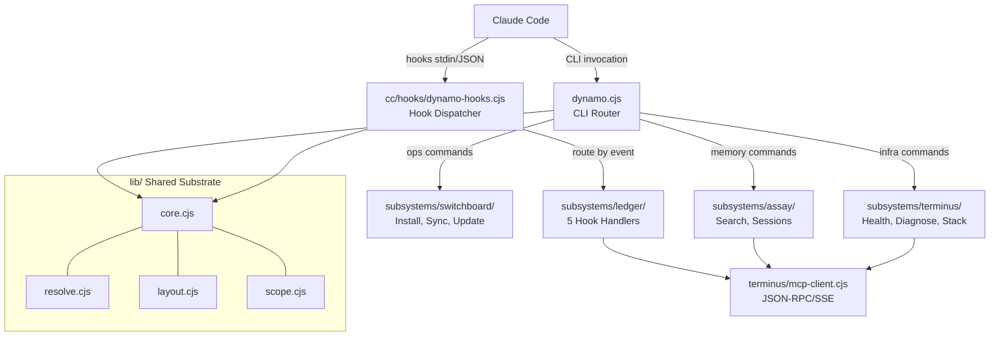

<objective>
Update all documentation to reflect the six-subsystem architecture, regenerate stale codebase maps, evolve PROJECT.md with M1 decision records, close out the milestone in roadmaps, and tag v1.3-M1 on the dev branch.

Purpose: Ensure all user-facing documentation and planning artifacts accurately describe the current architecture and close the v1.3-M1 milestone with proper versioning and roadmap updates.
Output: Updated README, CLAUDE.md template, PROJECT.md, ROADMAP.md, MASTER-ROADMAP.md, regenerated codebase maps, and v1.3-M1 git tag
</objective>

<execution_context>
@/Users/tom.kyser/.claude/get-shit-done/workflows/execute-plan.md
@/Users/tom.kyser/.claude/get-shit-done/templates/summary.md
</execution_context>

<context>
@.planning/PROJECT.md
@.planning/ROADMAP.md
@.planning/STATE.md
@.planning/phases/22-m1-verification-and-cleanup/22-CONTEXT.md
@.planning/phases/22-m1-verification-and-cleanup/22-VERIFICATION.md
@.planning/phases/22-m1-verification-and-cleanup/22-01-SUMMARY.md
@.planning/phases/22-m1-verification-and-cleanup/22-02-SUMMARY.md
@.planning/phases/22-m1-verification-and-cleanup/22-03-SUMMARY.md
</context>

<tasks>

<task type="auto">
  <name>Task 1: Refresh README.md and CLAUDE.md template for six-subsystem architecture</name>
  <files>README.md, cc/CLAUDE.md.template</files>
  <read_first>
    - README.md (full file -- understand current structure, find Mermaid diagram, directory tree, command reference, test/LOC counts)
    - cc/CLAUDE.md.template (full file -- find path references to update)
    - lib/layout.cjs (getLayoutPaths output defines the canonical directory structure)
    - cc/settings-hooks.json (canonical hook command paths)
  </read_first>
  <action>
**README.md updates:**

1. **Architecture Mermaid diagram:** Replace the current diagram (which shows old Ledger/Switchboard routing) with one that reflects the six-subsystem architecture:


2. **Directory tree:** Replace the old directory tree with the actual current layout. Generate from the filesystem:
```
dynamo/
  ├── dynamo.cjs                  # CLI router
  ├── dynamo/                     # Meta (config.json, VERSION, migrations/)
  ├── cc/
  │   ├── hooks/dynamo-hooks.cjs  # Hook dispatcher
  │   ├── prompts/                # Prompt templates
  │   ├── settings-hooks.json     # Hook registration template
  │   └── CLAUDE.md.template      # CLAUDE.md deployment template
  ├── lib/
  │   ├── core.cjs                # Shared utilities, env loading, config
  │   ├── resolve.cjs             # Centralized path resolver
  │   ├── layout.cjs              # Layout paths and sync pair definitions
  │   ├── scope.cjs               # Scope validation (SCOPE, validateGroupId)
  │   ├── pretty.cjs              # Output formatting
  │   └── dep-graph.cjs           # Dependency graph analysis
  ├── subsystems/
  │   ├── switchboard/            # Install, sync, update, update-check
  │   ├── assay/                  # Search, sessions
  │   ├── ledger/                 # Curation, episodes, 5 hook handlers
  │   ├── terminus/               # Health-check, diagnose, MCP client, stages, session-store, stack, migrate, verify-memory
  │   └── reverie/                # Stub (.gitkeep) -- Inner Voice (M2)
  └── dynamo/tests/               # 27 test files, 479+ tests
```

3. **Test and LOC counts:** Update any references:
   - Old: "272+ tests" or "374+ tests" -> New: "479+ tests"
   - Old: any stale LOC count -> Get fresh count: `wc -l` on all production .cjs files
   - Old: "6-stage health check" -> New: "8-stage health check"

4. **Component description:** Update the architecture section text to describe the six subsystems (Dynamo, Switchboard, Ledger, Assay, Terminus, Reverie) instead of the old 3-directory model.

5. **Command reference:** Verify all command examples still use correct paths. The `dynamo` CLI commands should not have changed, but verify there are no references to old paths like `ledger/hooks/` or `switchboard/`.

**CLAUDE.md template updates:**

1. Read `cc/CLAUDE.md.template` thoroughly
2. Search for any path references that use old directory names:
   - `ledger/hooks/` -> should be `cc/hooks/` or `subsystems/ledger/hooks/` depending on context
   - `switchboard/` -> should be `subsystems/switchboard/`
   - `dynamo/core.cjs` -> should be `lib/core.cjs`
   - Any reference to "6-stage health check" -> "8-stage health check"
   - Any reference to old test counts -> update to 479+
3. Verify the Component Architecture table lists all six subsystems with correct directories
4. Update any references to session storage to mention SQLite as the default backend
5. If the template references `sessions.json` as the data store, update to mention SQLite with JSON fallback
  </action>
  <verify>
    <automated>cd "/Users/tom.kyser/Library/Mobile Documents/com~apple~CloudDocs/dev/my-cc-setup" && grep -c 'subsystems/' README.md && grep -c 'cc/hooks' README.md && grep -c 'subsystems/' cc/CLAUDE.md.template</automated>
  </verify>
  <acceptance_criteria>
    - README.md contains `subsystems/switchboard` in the directory tree
    - README.md contains `subsystems/assay` in the directory tree
    - README.md contains `subsystems/ledger` in the directory tree
    - README.md contains `subsystems/terminus` in the directory tree
    - README.md contains `subsystems/reverie` in the directory tree
    - README.md contains `cc/hooks/dynamo-hooks.cjs` in the Mermaid diagram or directory tree
    - README.md contains `lib/` references for shared substrate
    - README.md does NOT contain `ledger/hooks/` as a top-level directory reference (old layout)
    - README.md does NOT contain "6-stage health check" (old count)
    - README.md does NOT contain "272" or "374" as test counts (old counts)
    - cc/CLAUDE.md.template contains `cc/hooks/dynamo-hooks.cjs` for hook path references
    - cc/CLAUDE.md.template contains references to all six subsystems in the Component Architecture table
    - cc/CLAUDE.md.template does NOT contain `dynamo/core.cjs` as a path (should be `lib/core.cjs`)
  </acceptance_criteria>
  <done>README.md fully updated with six-subsystem architecture: new Mermaid diagram, accurate directory tree, correct test/LOC counts, updated component descriptions. CLAUDE.md template updated with correct paths and subsystem references.</done>
</task>

<task type="auto">
  <name>Task 2: Evolve PROJECT.md, update roadmaps, and tag v1.3-M1</name>
  <files>.planning/PROJECT.md, .planning/ROADMAP.md, MASTER-ROADMAP.md</files>
  <read_first>
    - .planning/PROJECT.md (full file -- understand current structure, find "What This Is", "Current State", decision records, metrics)
    - .planning/ROADMAP.md (full file -- find Phase 21 and Phase 22 entries, M1 milestone section)
    - MASTER-ROADMAP.md (full file -- find 1.3-M1 section to mark as shipped)
    - .planning/phases/22-m1-verification-and-cleanup/22-VERIFICATION.md (final results to reference)
    - .planning/STATE.md (current state for reference)
  </read_first>
  <action>
**PROJECT.md evolution:**

1. **"What This Is" section:** Update the description to reflect the completed M1 state:
   - Mention six-subsystem architecture is now implemented (not just specified)
   - Update test count to actual count from VERIFICATION.md (479+, plus any new from m1-verification.test.cjs)
   - Update LOC count: run `wc -l` on all production .cjs files (`subsystems/**/*.cjs cc/**/*.cjs lib/*.cjs dynamo.cjs`) and use that number
   - Add SQLite session storage as a shipped capability
   - Add management hardening (input validation, boundary markers, Node.js version check) as shipped
   - Remove references to MENH-06 and MENH-07 from target features (they were removed from scope)

2. **"Current State" section:** Update to reflect M1 completion:
   - "Active milestone" should become "Shipped: v1.3-M1 Foundation and Infrastructure Refactor (2026-03-20)"
   - Add paragraph summarizing M1 delivery: directory restructure, centralized resolver, layout mapping, sync/install/deploy pipeline updates, dependency verification, input sanitization, SQLite session storage
   - Update "Phase 19 complete" paragraph to cover all phases through 22

3. **"Current Milestone" section:** Update from "v1.3-M1 Foundation and Infrastructure Refactor" to reflect that M1 is shipped. Either:
   - Rename to "Last Completed Milestone" with M1 details, OR
   - Update to show the next milestone (M2) if known, with M1 noted as completed above

4. **Decision records:** Add new Key Decisions entries for Phases 18-22:
   - Phase 18: Centralized path resolver in lib/resolve.cjs; static circular dependency detection
   - Phase 19: Six-subsystem directory restructure; lib/layout.cjs as single source of truth; 8 sync pairs
   - Phase 20: Node.js version verification in health-check; input validation + boundary markers in hook dispatcher
   - Phase 21: SQLite session storage via node:sqlite; dual-write pattern (SQLite authoritative, JSON backward compat); graceful JSON fallback
   - Phase 22: Re-export audit (removed 5 unused re-exports from core.cjs); end-to-end M1 verification with tmpdir sandbox

5. **Metrics:** Update LOC, test count, file count based on actual values

**ROADMAP.md updates:**

1. **Phase 21 plan checkboxes:** Change from `[ ]` to `[x]`:
   ```
   - [x] 21-01-PLAN.md -- Create SQLite session storage layer in Terminus with comprehensive test suite
   - [x] 21-02-PLAN.md -- Wire sessions.cjs delegation, install migration step, and health-check storage stage
   ```

2. **Phase 22 entry:** Update from TBD to complete:
   ```
   - [x] **Phase 22: M1 Verification and Cleanup** - End-to-end validation of all M1 deliverables in deployed layout (completed 2026-03-20)
   ```
   Add plan list:
   ```
   **Plans**: 4 plans
   Plans:
   - [x] 22-01-PLAN.md -- Automated M1 verification (tmpdir sandbox, smoke tests, draft VERIFICATION.md)
   - [x] 22-02-PLAN.md -- Cleanup (core.cjs re-export audit, dead code removal, stale comment fixes)
   - [x] 22-03-PLAN.md -- Real install verification and VERIFICATION.md finalization
   - [x] 22-04-PLAN.md -- Documentation refresh and milestone closure
   ```

3. **M1 milestone:** Mark as complete in the milestone list at the top:
   ```
   - [x] **v1.3-M1 Foundation and Infrastructure Refactor** -- Phases 18-22 (shipped 2026-03-20)
   ```

4. **Progress table:** Update Phase 21 and Phase 22 rows:
   - Phase 21: `v1.3-M1 | 2/2 | Complete | 2026-03-20`
   - Phase 22: `v1.3-M1 | 4/4 | Complete | 2026-03-20`

**MASTER-ROADMAP.md updates:**

1. Find the `### 1.3-M1: Foundation and Infrastructure Refactor` section
2. Add a shipped marker. Either:
   - Add `**Status: SHIPPED** (2026-03-20)` under the section header, OR
   - Move the section into a `<details>` collapse block like the completed milestones, OR
   - Add a note: `> Shipped 2026-03-20. 5 phases (18-22), 12 plans, all 14 requirements validated.`
3. Update `**Last updated:**` date at the top of the file to 2026-03-20

**Git tag:**

After all documentation updates are committed, create an annotated tag:
```bash
git tag -a v1.3-M1 -m "v1.3-M1: Foundation and Infrastructure Refactor

Six-subsystem architecture (ARCH-01 through ARCH-07), management hardening
(MGMT-01, MGMT-08a, MGMT-08b), and SQLite session storage (DATA-01 through
DATA-04). 5 phases, 12 plans, 479+ tests, all 14 requirements validated."
```

Do NOT push the tag or merge to master. Tag lives on dev branch only per user decision.
  </action>
  <verify>
    <automated>cd "/Users/tom.kyser/Library/Mobile Documents/com~apple~CloudDocs/dev/my-cc-setup" && node --test dynamo/tests/**/*.test.cjs dynamo/tests/*.test.cjs 2>&1 | tail -3 && git tag -l 'v1.3-M1' && grep -c 'shipped 2026-03-20\|SHIPPED\|v1.3-M1.*shipped\|v1.3-M1.*complete' .planning/ROADMAP.md MASTER-ROADMAP.md</automated>
  </verify>
  <acceptance_criteria>
    - `node --test dynamo/tests/**/*.test.cjs dynamo/tests/*.test.cjs` exits 0 with 0 failures (regression gate)
    - `git tag -l 'v1.3-M1'` returns `v1.3-M1` (tag exists)
    - .planning/ROADMAP.md contains `[x] **v1.3-M1 Foundation and Infrastructure Refactor**` (milestone marked complete)
    - .planning/ROADMAP.md Phase 22 entry shows "completed 2026-03-20"
    - .planning/ROADMAP.md Phase 22 shows `**Plans**: 4 plans`
    - .planning/ROADMAP.md Phase 21 plan list shows `[x]` for both plans (not `[ ]`)
    - MASTER-ROADMAP.md contains "SHIPPED" or "shipped" near the M1 section
    - MASTER-ROADMAP.md `Last updated` shows `2026-03-20`
    - .planning/PROJECT.md contains decision records for Phases 18-22
    - .planning/PROJECT.md contains updated LOC and test counts (not old values of 374 or 272)
    - .planning/PROJECT.md does NOT list MENH-06 or MENH-07 as target features
  </acceptance_criteria>
  <done>PROJECT.md evolved with M1 decision records and current metrics. ROADMAP.md shows Phase 22 complete and v1.3-M1 shipped. MASTER-ROADMAP.md shows M1 shipped. Git tag v1.3-M1 created on dev branch (not pushed). Full test suite still passes.</done>
</task>

<task type="auto">
  <name>Task 3: Regenerate all 7 codebase maps via /gsd:map-codebase</name>
  <files>.planning/codebase/ARCHITECTURE.md, .planning/codebase/CONCERNS.md, .planning/codebase/CONVENTIONS.md, .planning/codebase/INTEGRATIONS.md, .planning/codebase/STACK.md, .planning/codebase/STRUCTURE.md, .planning/codebase/TESTING.md</files>
  <action>
The 7 codebase maps in `.planning/codebase/` are stale (dated pre-Phase 19, reflecting the old 3-directory layout). Per user decision, regenerate all 7 via `/gsd:map-codebase`.

**Step 1: Delete all stale codebase maps** to ensure a clean regeneration:
```bash
rm -f .planning/codebase/ARCHITECTURE.md .planning/codebase/CONCERNS.md .planning/codebase/CONVENTIONS.md .planning/codebase/INTEGRATIONS.md .planning/codebase/STACK.md .planning/codebase/STRUCTURE.md .planning/codebase/TESTING.md
```

**Step 2: Run the /gsd:map-codebase workflow.** This is a GSD orchestration command. Invoke it by running:
```bash
claude --print "Run /gsd:map-codebase to regenerate all codebase maps in .planning/codebase/"
```

If the above does not work (executor may not have access to spawn a sub-agent), use the underlying skill directly. Read the map-codebase skill definition to find the actual implementation:
```bash
cat ~/.claude/get-shit-done/skills/map-codebase/SKILL.md 2>/dev/null || cat ~/.claude/get-shit-done/workflows/map-codebase.md 2>/dev/null
```

Then follow the skill's instructions to regenerate all 7 maps. The maps should analyze the current codebase and produce fresh documentation for: ARCHITECTURE.md, CONCERNS.md, CONVENTIONS.md, INTEGRATIONS.md, STACK.md, STRUCTURE.md, TESTING.md.

**Step 3: Verify all 7 files were regenerated:**
```bash
ls -la .planning/codebase/
```
All 7 files should exist with current timestamps.

**Step 4: Spot-check accuracy** -- confirm the regenerated maps reference the six-subsystem layout:
```bash
grep -l 'subsystems/' .planning/codebase/*.md | wc -l
```
At least STRUCTURE.md and ARCHITECTURE.md should reference `subsystems/`.

**IMPORTANT:** If the /gsd:map-codebase skill cannot be invoked programmatically within the executor context, create the 7 files manually by analyzing the current codebase. Each map should follow the existing format (read one of the stale files first for structure) but reflect the actual current six-subsystem architecture. However, the preferred approach is to use the GSD skill since it produces standardized output.
  </action>
  <verify>
    <automated>cd "/Users/tom.kyser/Library/Mobile Documents/com~apple~CloudDocs/dev/my-cc-setup" && test -f .planning/codebase/ARCHITECTURE.md && test -f .planning/codebase/CONCERNS.md && test -f .planning/codebase/CONVENTIONS.md && test -f .planning/codebase/INTEGRATIONS.md && test -f .planning/codebase/STACK.md && test -f .planning/codebase/STRUCTURE.md && test -f .planning/codebase/TESTING.md && grep -l 'subsystems/' .planning/codebase/*.md | wc -l</automated>
  </verify>
  <acceptance_criteria>
    - All 7 files exist in .planning/codebase/: ARCHITECTURE.md, CONCERNS.md, CONVENTIONS.md, INTEGRATIONS.md, STACK.md, STRUCTURE.md, TESTING.md
    - Files have current timestamps (not pre-Phase 19 dates)
    - At least STRUCTURE.md and ARCHITECTURE.md contain references to `subsystems/`
    - Files do NOT reference the old 3-directory layout as current (e.g., should not describe `ledger/` as a top-level directory)
    - STACK.md references node:sqlite as a dependency
  </acceptance_criteria>
  <done>All 7 codebase maps in .planning/codebase/ regenerated to reflect the current six-subsystem architecture. Maps are accurate for M2 planning.</done>
</task>

</tasks>

<verification>
- README.md accurately describes six-subsystem architecture
- CLAUDE.md template has correct paths
- PROJECT.md has M1 decision records and updated metrics
- ROADMAP.md shows all phases complete and M1 milestone shipped
- MASTER-ROADMAP.md shows M1 shipped
- `git tag -l 'v1.3-M1'` returns the tag
- `node --test dynamo/tests/**/*.test.cjs dynamo/tests/*.test.cjs` still passes (no regressions from doc changes)
- All 7 codebase maps exist in .planning/codebase/ with current content reflecting six-subsystem architecture
</verification>

<success_criteria>
1. README.md has six-subsystem Mermaid diagram, accurate directory tree, correct counts
2. CLAUDE.md template has no stale path references
3. PROJECT.md evolved with M1 decisions and metrics
4. Both ROADMAP.md and MASTER-ROADMAP.md show M1 as shipped
5. Git tag v1.3-M1 exists on dev branch
6. Test suite still passes
7. All 7 codebase maps regenerated with accurate six-subsystem content
</success_criteria>

<output>
After completion, create `.planning/phases/22-m1-verification-and-cleanup/22-04-SUMMARY.md`
</output>
