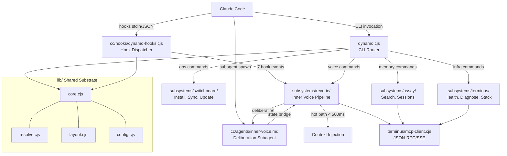

# Dynamo

A Claude Code power-user platform for persistent memory and intelligent context injection, built on Node/CJS with a Graphiti knowledge graph backend and an Inner Voice cognitive pipeline.

## What It Does

- **Inner Voice cognitive pipeline** -- every hook event flows through entity extraction, activation mapping, dual-path routing, and adversarial-framed injection formatting
- **Dual-path architecture** -- deterministic hot path (<500ms) for immediate context; deliberation path spawns a Sonnet subagent for deeper reasoning on semantic shifts
- **Automatic context injection** -- sessions start with relevant preferences, project context, and recent session summaries from the knowledge graph
- **Prompt augmentation** -- every user prompt is enriched with semantically relevant memories before Claude processes it
- **Change tracking** -- file edits are captured as episodes in the knowledge graph for later retrieval
- **Pre-compaction preservation** -- before context window compression, key knowledge is extracted and re-injected so Claude retains critical facts
- **Session summarization** -- session summaries are stored in both project and session scopes
- **Voice CLI** -- `dynamo voice status/explain/reset` provides runtime visibility into Inner Voice state
- **CLI-based memory operations** -- search, store, recall, inspect, and manage knowledge graph data directly via the `dynamo` CLI

## Architecture

Dynamo comprises six subsystems: **Dynamo** (system wrapper -- CLI router, shared resources, API surface), **Switchboard** (install/sync/update lifecycle), **Ledger** (data construction -- episode creation, write operations), **Assay** (data access -- search, session queries), **Terminus** (data infrastructure -- MCP transport, Docker stack, health/diagnostics, SQLite session storage), and **Reverie** (Inner Voice -- cognitive processing, dual-path routing, activation management, curation).



### Directory Structure

```
dynamo/
  dynamo.cjs                  # CLI router (30+ commands)
  bin/dynamo                  # Bare CLI shim (no node prefix needed)
  dynamo/                     # Meta (config.json, VERSION, CHANGELOG.md, migrations/)
  cc/
    hooks/dynamo-hooks.cjs    # Hook dispatcher (7 events, input validation, boundary markers)
    agents/inner-voice.md     # Deliberation subagent definition (Sonnet, read-only tools)
    prompts/iv-*.md           # 5 Inner Voice prompt templates
    settings-hooks.json       # Hook registration template
    CLAUDE.md.template        # CLAUDE.md deployment template
  lib/
    core.cjs                  # Shared utilities, env loading
    config.cjs                # Config CLI (dot-notation get/set/validate)
    resolve.cjs               # Centralized path resolver
    layout.cjs                # Layout paths and sync pair definitions
    scope.cjs                 # Scope validation
    pretty.cjs                # Output formatting
    dep-graph.cjs             # Dependency graph analysis
  subsystems/switchboard/     # Install, sync, update, update-check
  subsystems/assay/           # Search, sessions (read operations)
  subsystems/ledger/          # Episodes, write operations
  subsystems/terminus/        # Health-check, diagnose, MCP client, stages, session-store,
                              #   stack, migrate, verify-memory
  subsystems/reverie/         # Inner Voice cognitive pipeline
    activation.cjs            #   Entity extraction, spreading activation, sublimation scoring
    dual-path.cjs             #   Path selection, semantic shift, recall detection
    curation.cjs              #   Template formatting, adversarial counter-prompting
    inner-voice.cjs           #   Pipeline orchestrator, state bridge
    state.cjs                 #   Inner Voice state persistence
    voice.cjs                 #   Voice CLI (status/explain/reset)
    handlers/                 #   7 Reverie hook handlers
  tests/                      # 37 test files, 525+ tests
```

## Installation

### 1. Clone the repo

```bash
git clone git@github.com:tomkyser/dynamo.git
cd dynamo
```

### 2. Create your `.env`

```bash
cp .env.example ~/.claude/graphiti/.env
```

The `.env` file deploys to `~/.claude/graphiti/.env`.

### 3. Run the installer

```bash
node dynamo.cjs install
```

The installer performs 10 steps:

1. **Check dependencies** -- verifies Node.js >= 22
2. **Copy files** -- deploys `subsystems/`, `cc/`, `lib/`, and root files to `~/.claude/dynamo/`
3. **Generate config** -- creates `config.json`
4. **Merge settings** -- adds hook definitions to `~/.claude/settings.json` (backs up first)
5. **Deregister MCP** -- removes direct Graphiti MCP (all access through Dynamo CLI)
6. **Deploy CLAUDE.md** -- copies template to `~/.claude/CLAUDE.md`
7. **Install CLI shim** -- creates `bin/dynamo` for bare CLI invocation
8. **Retire Python** -- moves legacy Python/Bash files to `~/.claude/graphiti-legacy/`
9. **Migrate sessions** -- converts `sessions.json` to SQLite (one-time, idempotent)
10. **Health check** -- verifies the deployment (8 stages)

### 4. Start the Docker stack

```bash
dynamo start
```

### 5. Restart Claude Code

Hooks and CLI activate on a fresh session.

### Deployed Layout

```
~/.claude/dynamo/             # Deployed by installer
  dynamo.cjs                  # CLI entry point
  bin/dynamo                  # Bare CLI shim
  dynamo/                     # Meta (config.json, VERSION, CHANGELOG.md)
  cc/
    hooks/dynamo-hooks.cjs    # Hook dispatcher
    agents/inner-voice.md     # Deliberation subagent
    prompts/iv-*.md           # Inner Voice templates
  lib/
    core.cjs                  # Shared substrate
    config.cjs                # Config CLI module
    resolve.cjs               # Path resolver
    layout.cjs                # Layout paths
  subsystems/switchboard/     # Install, sync, update
  subsystems/assay/           # Search, sessions
  subsystems/ledger/          # Episodes, write operations
  subsystems/terminus/        # Health, diagnose, MCP, session-store
  subsystems/reverie/         # Inner Voice pipeline + handlers/

~/.claude/graphiti/           # Graphiti infrastructure
  docker-compose.yml
  config.yaml
  .env                        # API keys (never committed)
  sessions.db                 # SQLite session database
  sessions.json               # JSON backup (backward compat)

~/.claude/CLAUDE.md           # Deployed from template
~/.claude/settings.json       # Hooks merged into this
```

## CLI Commands

All commands are invoked via `dynamo <command>` (bare CLI) or `node ~/.claude/dynamo/dynamo.cjs <command>`.

### Memory Operations

| Command | Description |
|---------|-------------|
| `dynamo search <query>` | Search knowledge graph for facts and entities |
| `dynamo search <query> --facts` | Search for facts (relationships) only |
| `dynamo search <query> --nodes` | Search for entity nodes only |
| `dynamo remember <content>` | Store a memory in the knowledge graph |
| `dynamo recall` | Retrieve episodes from a scope |
| `dynamo edge <uuid>` | Inspect a specific entity relationship |
| `dynamo forget <uuid>` | Delete an episode by UUID |
| `dynamo forget --edge <uuid>` | Delete a specific relationship |
| `dynamo clear --scope <scope> --confirm` | Clear all data for a scope (destructive) |

### Inner Voice

| Command | Description |
|---------|-------------|
| `dynamo voice status` | Full Inner Voice state dump (entities, activations, domain frame, predictions, self-model, injection history) |
| `dynamo voice explain` | Rationale for the last injection decision |
| `dynamo voice reset` | Clear self-model, predictions, and injection history (preserves activation map) |
| `dynamo config get <key>` | Read a config value (e.g., `dynamo config get reverie.spawn_budget`) |
| `dynamo config set <key> <value>` | Set a config value with type coercion and validation |

### Session Management

| Command | Description |
|---------|-------------|
| `dynamo session list` | List all sessions |
| `dynamo session view <id>` | View a specific session |
| `dynamo session label <id> <label>` | Label a session |
| `dynamo session backfill` | Backfill session metadata |

### System Operations

| Command | Description |
|---------|-------------|
| `dynamo start` | Start the Graphiti Docker stack with health wait |
| `dynamo stop` | Stop the Graphiti Docker stack (preserves data) |
| `dynamo install` | Deploy Dynamo to `~/.claude/dynamo/` (backup, copy, config, hooks, health check) |
| `dynamo rollback` | Restore previous version from backup |
| `dynamo check-update` | Check for available updates (shows changelog) |
| `dynamo update` | Update to latest version (backup, pull, migrate, verify, auto-rollback on failure) |
| `dynamo sync <direction>` | Bidirectional sync between repo and live deployment |
| `dynamo toggle <on\|off>` | Enable or disable Dynamo globally |
| `dynamo status` | Show Dynamo enabled/disabled state |
| `dynamo version` | Show Dynamo version |

### Diagnostics

| Command | Description |
|---------|-------------|
| `dynamo health-check` | Run 8-stage health check (Docker, Neo4j, API, MCP, env, canary, Node.js, session storage) |
| `dynamo diagnose` | Run all 13 diagnostic stages (deep system inspection) |
| `dynamo verify-memory` | Run 6 pipeline checks (write, read, scope isolation, sessions) |
| `dynamo test` | Run the Dynamo test suite |

### Common Options

| Option | Description |
|--------|-------------|
| `--scope <scope>` | Memory scope: `global`, `project-<name>`, `session-<ts>`, `task-<desc>` |
| `--format json` | Structured JSON output (stdout) |
| `--format raw` | Full source content from graph (stdout) |
| `--pretty` | Human-readable output for operational commands |
| `--verbose` | Show detailed stage output |
| `--dry-run` | Preview sync changes without applying |

### Examples

```bash
# Search for architecture decisions
dynamo search "auth strategy" --scope project-myapp

# Store a memory
dynamo remember "Prefers Opus with high reasoning effort"

# Check Inner Voice state
dynamo voice status

# See why the last injection happened (or didn't)
dynamo voice explain

# Sync repo changes to live deployment
dynamo sync repo-to-live --dry-run

# Check system health
dynamo health-check --pretty
```

## Hook System

Dynamo uses a single hook dispatcher (`dynamo-hooks.cjs`) that routes all 7 Claude Code hook events through the Reverie cognitive pipeline. All hooks receive JSON on stdin from Claude Code.

### Dispatcher Flow

```
stdin (JSON from Claude Code)
  -> parse JSON, extract hook_event_name
  -> toggle gate: if disabled, exit 0 silently
  -> input validation (field types, length limits)
  -> detectProject() from cwd
  -> build scope (project-{name} or global)
  -> route to Reverie handler
  -> handler runs cognitive pipeline (entity extraction -> activation -> path selection -> injection)
  -> output wrapped in <dynamo-memory-context> boundary markers
  -> exit 0 (always -- never block Claude Code)
```

### Hook Events

| Event | Matcher | Handler | What It Does |
|-------|---------|---------|-------------|
| SessionStart | `startup\|resume` | `session-start.cjs` | Injects global prefs + project context + recent sessions as `[GRAPHITI MEMORY CONTEXT]` |
| SessionStart | `compact` | `session-start.cjs` | Same injection after context compaction |
| UserPromptSubmit | `""` (all) | `user-prompt.cjs` | Cognitive pipeline: entity extraction, activation update, semantic search, injection formatting |
| PostToolUse | `Write\|Edit\|MultiEdit` | `post-tool-use.cjs` | Captures file changes as episodes |
| PreCompact | `""` (all) | `pre-compact.cjs` | Preserves key knowledge before context compression |
| Stop | `""` (all) | `stop.cjs` | Session summary stored in project + session scopes |
| SubagentStart | `inner-voice` | `iv-subagent-start.cjs` | Packages deliberation context for Inner Voice subagent |
| SubagentStop | `inner-voice` | `iv-subagent-stop.cjs` | Writes deliberation results to state bridge (correlation ID + 60s TTL) |

### Key Behaviors

- **Toggle gate**: hooks exit silently (exit 0) when Dynamo is disabled
- **Foreground execution**: all hooks run in the foreground with timeouts (10-30s depending on event)
- **Input validation**: field type checks, length limits, unknown event rejection at dispatcher entry
- **Boundary markers**: all output wrapped in `<dynamo-memory-context>` to contain prompt bleed
- **Dual-path routing**: deterministic path selection (hot/deliberation/skip) without LLM calls
- **Graceful degradation**: if Graphiti stack is down or subagent spawn fails, hooks degrade to hot-path-only

## Cognitive Pipeline

The Inner Voice processes every hook event through a cognitive pipeline:

1. **Entity extraction** -- identifies project names, file paths, function names, technical terms (<5ms)
2. **Activation update** -- updates entity relevance scores with time-based decay and 1-hop spreading activation
3. **Domain classification** -- categorizes prompts into engineering/debugging/architecture/social/general (<1ms)
4. **Sublimation scoring** -- composite score (activation * surprise * relevance * (1 - cognitive_load) * confidence)
5. **Path selection** -- deterministic routing: hot path (<500ms), deliberation (subagent), or skip
6. **Injection formatting** -- template-based with adversarial counter-prompting, token limits (500/150/50 by context)
7. **State persistence** -- atomic write with corruption recovery

### Dual-Path Architecture

**Hot path** (<500ms): Synchronous entity extraction, activation lookup, template formatting. Used for most events.

**Deliberation path** (2-10s): Spawns `inner-voice` subagent (Sonnet model, read-only tools) for semantic shifts, low-confidence signals, or explicit recall. Results written to state bridge with correlation ID and 60s TTL, consumed atomically by next `UserPromptSubmit`.

**Skip**: When predictions match (expected topic/activity), no injection needed.

## Configuration

### `config.json`

Generated by the installer. Located at `~/.claude/dynamo/config.json`.

| Key | Description |
|-----|-------------|
| `enabled` | Global toggle. `false` disables all hooks and memory commands. |
| `graphiti.mcp_url` | Graphiti MCP server endpoint for JSON-RPC calls |
| `graphiti.health_url` | Health check endpoint |
| `reverie.spawn_budget` | Daily deliberation subagent spawn limit (default: 20) |
| `timeouts.*` | Per-operation timeout in milliseconds |
| `logging.max_size_bytes` | Log rotation threshold (1MB default) |

### Environment Variables

| Variable | Location | Purpose |
|----------|----------|---------|
| `DYNAMO_DEV` | Process env | Set to `1` to use repo version instead of deployed |
| `DYNAMO_CONFIG_PATH` | Process env | Override config.json path (test isolation) |

## Scoping

All data in the knowledge graph is organized by scope (Graphiti `group_id`).

| Scope | Format | Contents | Example |
|-------|--------|----------|---------|
| Global | `global` | User preferences, workflow patterns, coding style | `dynamo search "tools" --scope global` |
| Project | `project-<name>` | Architecture, decisions, conventions | `dynamo remember "Uses JWT" --scope project-myapp` |
| Session | `session-<timestamp>` | Conversation summaries | `dynamo recall --scope session-1710000000` |
| Task | `task-<descriptor>` | Task requirements, progress | `dynamo remember "Migrate auth" --scope task-auth-refactor` |

**Important:** Scope values use **dash** separators (not colons). Graphiti rejects colons in `group_id`.

## Troubleshooting

### "Dynamo is disabled" error

```bash
dynamo toggle on         # Re-enable
DYNAMO_DEV=1 dynamo search "test"  # Or bypass for development
```

### Stack not starting

```bash
dynamo health-check --pretty       # Detailed diagnostics
docker ps                          # Check Docker
curl http://localhost:8100/health  # Direct health check
```

### Hook errors

```bash
cat ~/.claude/dynamo/hook-errors.log  # Check error log (rotates at 1MB)
```

### Deep diagnostics

```bash
dynamo diagnose --pretty --verbose   # 13-stage deep inspection
dynamo verify-memory --pretty        # Full pipeline verification
```

## Development Guide

### Workflow

1. Edit source files in the repo (`subsystems/`, `cc/`, `lib/`, `dynamo.cjs`)
2. Sync to live deployment: `dynamo sync repo-to-live`
3. Test: `dynamo test`
4. Restart Claude Code to pick up hook changes

### Sync Pairs

The sync system maps 9 repo directories to deployed locations (defined in `lib/layout.cjs`):

| Repo Directory | Deployed Location | Label |
|---------------|-------------------|-------|
| `./` (root files only) | `~/.claude/dynamo/` | root |
| `dynamo/` | `~/.claude/dynamo/dynamo/` | dynamo-meta |
| `subsystems/switchboard/` | `~/.claude/dynamo/subsystems/switchboard/` | switchboard |
| `subsystems/assay/` | `~/.claude/dynamo/subsystems/assay/` | assay |
| `subsystems/ledger/` | `~/.claude/dynamo/subsystems/ledger/` | ledger |
| `subsystems/terminus/` | `~/.claude/dynamo/subsystems/terminus/` | terminus |
| `subsystems/reverie/` | `~/.claude/dynamo/subsystems/reverie/` | reverie |
| `cc/` | `~/.claude/dynamo/cc/` | cc |
| `lib/` | `~/.claude/dynamo/lib/` | lib |

### Running Tests

```bash
dynamo test   # Via CLI (from anywhere)
```

All tests use `tmpdir` for isolation -- no shared state, no side effects on the live deployment.

## Milestones

| Version | Name | Phases | Shipped |
|---------|------|--------|---------|
| v1.0 | Research and Ranked Report | 1-3 | 2026-03-17 |
| v1.1 | Fix Memory System | 4-7 | 2026-03-17 |
| v1.2 | Dynamo Foundation | 8-11 | 2026-03-18 |
| v1.2.1 | Stabilization and Polish | 12-17 | 2026-03-19 |
| v1.3-M1 | Foundation and Infrastructure Refactor | 18-22 | 2026-03-20 |
| v1.3-M2 | Core Intelligence | 23-25 | 2026-03-21 |

**Total:** 25 phases, 69 plans, ~7,081 production LOC, 525+ tests across 37 test files.

## License

MIT
