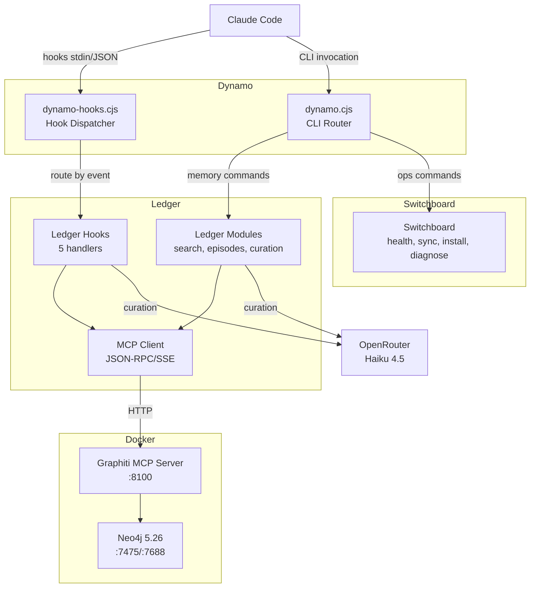

# Dynamo

A Claude Code power-user platform for persistent memory and self-management, built on Node/CJS with a Graphiti knowledge graph backend.

## What It Does

- **Automatic context injection** -- every session starts with relevant preferences, project context, and recent session summaries pulled from the knowledge graph
- **Prompt augmentation** -- every user prompt is enriched with semantically relevant memories before Claude processes it
- **Change tracking** -- file edits are captured as episodes in the knowledge graph for later retrieval
- **Pre-compaction preservation** -- before context window compression, key knowledge is extracted and re-injected so Claude retains critical facts
- **Session summarization** -- when a session ends, a Haiku-generated summary is stored in both project and session scopes
- **CLI-based memory operations** -- search, store, recall, inspect, and manage knowledge graph data directly via the `dynamo` CLI

## Architecture



### Directory Structure

```
dynamo/                 # Orchestration layer
  dynamo.cjs            # CLI router (25 commands)
  core.cjs              # Shared substrate
  config.json           # Runtime config
  VERSION               # Semantic version
  hooks/
    dynamo-hooks.cjs    # Single hook dispatcher (5 events)
  prompts/              # Curation prompt templates
  tests/                # All tests (272+)

ledger/                 # Memory subsystem
  mcp-client.cjs        # MCPClient + SSE parsing
  scope.cjs             # Scope constants and validation
  search.cjs            # Combined/fact/node search
  episodes.cjs          # Episode add/extract
  curation.cjs          # Haiku curation pipeline
  sessions.cjs          # Session management
  hooks/                # 5 hook handlers
  graphiti/             # Docker infrastructure
    docker-compose.yml
    config.yaml
    start-graphiti.sh
    stop-graphiti.sh

switchboard/            # Operations subsystem
  install.cjs           # CJS installer
  sync.cjs              # Bidirectional sync
  health-check.cjs      # 6-stage health check
  diagnose.cjs          # 13-stage diagnostics
  verify-memory.cjs     # Pipeline verification
  stack.cjs             # Docker start/stop
  stages.cjs            # Shared diagnostic stages
  pretty.cjs            # Human-readable formatters

claude-config/          # Integration templates
  CLAUDE.md.template    # Memory system rules
  settings-hooks.json   # Hook definitions
```

## Installation

### 1. Clone the repo

```bash
git clone https://github.com/tomkyser/dynamo
cd dynamo
```

### 2. Create your `.env`

```bash
cp ledger/graphiti/.env.example ledger/graphiti/.env
# Add your OpenRouter API key:
#   OPENROUTER_API_KEY=sk-or-...
```

The `.env` file lives at `ledger/graphiti/.env` in the repo and deploys to `~/.claude/graphiti/.env`.

### 3. Run the installer

```bash
node dynamo/dynamo.cjs install
```

The installer performs 6 steps:

1. **Copy files** -- `dynamo/`, `ledger/`, `switchboard/` trees to `~/.claude/dynamo/`
2. **Generate config** -- creates `config.json` from `.env` values
3. **Merge settings** -- adds hook definitions to `~/.claude/settings.json` (backs up first)
4. **Register MCP** -- registers Graphiti MCP server via `claude mcp add`
5. **Retire Python** -- moves legacy Python/Bash files to `~/.claude/graphiti-legacy/`
6. **Health check** -- verifies the deployment

### 4. Start the Docker stack

```bash
node dynamo/dynamo.cjs start
```

### 5. Restart Claude Code

Hooks and CLI activate on a fresh session.

### Deployed Layout

```
~/.claude/dynamo/             # Deployed by installer
  dynamo.cjs                  # CLI entry point
  core.cjs                    # Shared substrate
  config.json                 # Generated from .env values
  VERSION                     # Current version
  hooks/
    dynamo-hooks.cjs          # Single dispatcher for all hooks
  prompts/                    # Curation templates
  ledger/                     # Memory modules
    mcp-client.cjs
    scope.cjs
    search.cjs
    episodes.cjs
    curation.cjs
    sessions.cjs
    hooks/                    # Hook handlers
  switchboard/                # Operations modules
    install.cjs
    sync.cjs
    health-check.cjs
    ...

~/.claude/graphiti/           # Graphiti infrastructure
  docker-compose.yml
  config.yaml
  .env                        # API keys (never committed)
  start-graphiti.sh
  stop-graphiti.sh
  sessions.json               # Session index

~/.claude/CLAUDE.md           # Deployed from template
~/.claude/settings.json       # Hooks merged into this
```

## CLI Commands

All commands are invoked via `node ~/.claude/dynamo/dynamo.cjs <command>` (or `node dynamo/dynamo.cjs <command>` from the repo).

### Memory Operations

| Command | Description |
|---------|-------------|
| `dynamo search <query>` | Search knowledge graph for facts and entities |
| `dynamo search <query> --facts` | Search for facts (relationships) only |
| `dynamo search <query> --nodes` | Search for entity nodes only |
| `dynamo remember <content>` | Store a memory in the knowledge graph |
| `dynamo recall` | Retrieve episodes from a scope |
| `dynamo edge <uuid>` | Inspect a specific entity relationship |
| `dynamo forget <uuid>` | Delete an episode by UUID |
| `dynamo forget --edge <uuid>` | Delete a specific relationship |
| `dynamo clear --scope <scope> --confirm` | Clear all data for a scope (destructive) |

### Session Management

| Command | Description |
|---------|-------------|
| `dynamo session list` | List all sessions |
| `dynamo session view <id>` | View a specific session |
| `dynamo session label <id> <label>` | Label a session |
| `dynamo session backfill` | Backfill session metadata |

### System Operations

| Command | Description |
|---------|-------------|
| `dynamo start` | Start the Graphiti Docker stack with health wait |
| `dynamo stop` | Stop the Graphiti Docker stack (preserves data) |
| `dynamo install` | Deploy CJS system to `~/.claude/dynamo/` |
| `dynamo rollback` | Restore `settings.json.bak` and undo retirement |
| `dynamo sync <direction>` | Bidirectional sync between repo and live deployment |
| `dynamo toggle <on\|off>` | Enable or disable Dynamo globally |
| `dynamo status` | Show Dynamo enabled/disabled state |
| `dynamo version` | Show Dynamo version |

### Diagnostics

| Command | Description |
|---------|-------------|
| `dynamo health-check` | Run 6-stage health check (Docker, Neo4j, API, MCP, env, canary) |
| `dynamo diagnose` | Run all 13 diagnostic stages (deep system inspection) |
| `dynamo verify-memory` | Run 6 pipeline checks (write, read, scope isolation, sessions) |
| `dynamo test` | Run the Dynamo test suite |

### Common Options

| Option | Description |
|--------|-------------|
| `--scope <scope>` | Memory scope: `global`, `project-<name>`, `session-<ts>`, `task-<desc>` |
| `--format json` | Structured JSON output (stdout) |
| `--format raw` | Full source content from graph (stdout) |
| `--pretty` | Human-readable output for operational commands |
| `--verbose` | Show detailed stage output |
| `--dry-run` | Preview sync changes without applying |

### Examples

```bash
# Search for architecture decisions in a project
dynamo search "auth strategy" --scope project-myapp

# Store a memory in the global scope
dynamo remember "Prefers Opus with high reasoning effort"

# Recall episodes from a project scope
dynamo recall --scope project-dynamo --format json

# Sync repo changes to live deployment
dynamo sync repo-to-live --dry-run

# Check system health
dynamo health-check --pretty

# View recent sessions
dynamo session list --pretty
```

## Hook System

Dynamo uses a single hook dispatcher (`dynamo-hooks.cjs`) that routes all 5 Claude Code hook events to their handlers. All hooks receive JSON on stdin from Claude Code.

### Dispatcher Flow

```
stdin (JSON from Claude Code)
  -> parse JSON, extract hook_event_name
  -> toggle gate: if disabled, exit 0 silently
  -> detectProject() from cwd
  -> build scope (project-{name} or global)
  -> route to handler
  -> exit 0 (always -- never block Claude Code)
```

### Hook Events

| Event | Matcher | Handler | What It Does |
|-------|---------|---------|-------------|
| SessionStart | `startup\|resume` | `session-start.cjs` | Injects global prefs + project context + recent sessions as `[GRAPHITI MEMORY CONTEXT]` |
| SessionStart | `compact` | `session-start.cjs` | Same injection after context compaction |
| UserPromptSubmit | `""` (all) | `prompt-augment.cjs` | Semantic search per prompt, injects `[RELEVANT MEMORY]` (skips prompts < 15 chars) |
| PostToolUse | `Write\|Edit\|MultiEdit` | `capture-change.cjs` | Captures file changes as episodes (fire-and-forget) |
| PreCompact | `""` (all) | `preserve-knowledge.cjs` | Summarizes conversation via Haiku, stores summary, re-injects as `[PRESERVED CONTEXT]` |
| Stop | `""` (all) | `session-summary.cjs` | Summarizes session via Haiku, stores in project + session scopes |

### Key Behaviors

- **Toggle gate**: hooks exit silently (exit 0) when Dynamo is disabled -- never error, never block
- **Foreground execution**: all hooks run in the foreground with timeouts (10-30s depending on event)
- **Project auto-detection**: determines project from git remote, `package.json`, `composer.json`, `pyproject.toml`, or `.ddev/config.yaml`
- **Haiku curation**: all retrieved memories pass through Claude Haiku to filter noise before injection
- **Graceful degradation**: if the Graphiti stack is down, hooks exit cleanly and Claude Code continues normally

## Configuration

### `config.json`

Generated by the installer from `.env` values. Located at `~/.claude/dynamo/config.json`.

```json
{
  "version": "0.1.0",
  "enabled": true,
  "graphiti": {
    "mcp_url": "http://localhost:8100/mcp",
    "health_url": "http://localhost:8100/health"
  },
  "curation": {
    "model": "anthropic/claude-haiku-4.5",
    "api_url": "https://openrouter.ai/api/v1/chat/completions"
  },
  "timeouts": {
    "health": 3000,
    "mcp": 5000,
    "curation": 10000,
    "summarization": 15000
  },
  "logging": {
    "max_size_bytes": 1048576,
    "file": "hook-errors.log"
  }
}
```

| Key | Description |
|-----|-------------|
| `enabled` | Global toggle. `false` disables all hooks and memory commands. |
| `graphiti.mcp_url` | Graphiti MCP server endpoint for JSON-RPC calls |
| `graphiti.health_url` | Health check endpoint |
| `curation.model` | LLM model for curation and summarization (via OpenRouter) |
| `curation.api_url` | OpenRouter API endpoint |
| `timeouts.*` | Per-operation timeout in milliseconds |
| `logging.max_size_bytes` | Log rotation threshold (1MB default) |
| `logging.file` | Error log filename (relative to `~/.claude/dynamo/`) |

### Environment Variables

| Variable | Location | Purpose |
|----------|----------|---------|
| `OPENROUTER_API_KEY` | `~/.claude/graphiti/.env` | API key for LLM curation and embeddings via OpenRouter |
| `DYNAMO_DEV` | Process env | Set to `1` to bypass global toggle (dev mode) |
| `DYNAMO_CONFIG_PATH` | Process env | Override config.json path (test isolation) |

### `settings-hooks.json`

Hook definitions merged into `~/.claude/settings.json` by the installer. Defines 5 hook events, each invoking `dynamo-hooks.cjs` with appropriate matchers and timeouts:

- `SessionStart` (startup|resume, compact) -- 30s timeout
- `UserPromptSubmit` (all prompts) -- 15s timeout
- `PostToolUse` (Write|Edit|MultiEdit) -- 10s timeout
- `PreCompact` (all) -- 30s timeout
- `Stop` (all) -- 30s timeout

Also sets `CLAUDE_CODE_SESSIONEND_HOOKS_TIMEOUT_MS=10000` environment variable.

## Scoping

All data in the knowledge graph is organized by scope (Graphiti `group_id`).

| Scope | Format | Contents | Example |
|-------|--------|----------|---------|
| Global | `global` | User preferences, workflow patterns, coding style | `dynamo search "tools" --scope global` |
| Project | `project-<name>` | Architecture, decisions, conventions | `dynamo remember "Uses JWT" --scope project-myapp` |
| Session | `session-<timestamp>` | Conversation summaries | `dynamo recall --scope session-1710000000` |
| Task | `task-<descriptor>` | Task requirements, progress | `dynamo remember "Migrate auth" --scope task-auth-refactor` |

**Important:** Scope values use **dash** separators (not colons). Graphiti rejects colons in `group_id`.

### Auto-Detection

Project names are auto-detected from the working directory in this priority order:

1. Git remote origin URL (repo name)
2. `package.json` `name` field
3. `composer.json` `name` field (last segment)
4. `pyproject.toml` `name` field
5. `.ddev/config.yaml` `name` field
6. Fallback: directory name

Hooks use the detected project name to build `project-<name>` scopes automatically.

## Troubleshooting

### "Dynamo is disabled" error

Dynamo is globally toggled off.

```bash
# Re-enable
dynamo toggle on

# Or bypass for development
DYNAMO_DEV=1 node ~/.claude/dynamo/dynamo.cjs search "test"
```

### Stack not starting

```bash
# Run health check for detailed diagnostics
dynamo health-check --pretty

# Check Docker is running
docker ps

# Check container status
docker compose -f ~/.claude/graphiti/docker-compose.yml ps

# Check health endpoint directly
curl http://localhost:8100/health
```

### Stale session IDs

If hooks return "invalid session" errors, restart Claude Code. The MCP client caches session IDs and does not refresh them after server restarts.

### Hook errors

Check the error log:

```bash
cat ~/.claude/dynamo/hook-errors.log
```

Logs rotate at 1MB (old log preserved as `hook-errors.log.old`).

### Health check failures

Run the 13-stage deep diagnostic:

```bash
dynamo diagnose --pretty --verbose
```

This covers Docker, Neo4j, Graphiti API, MCP connectivity, environment variables, configuration, toggle state, and more.

### Memory pipeline issues

Run the full pipeline verification:

```bash
dynamo verify-memory --pretty
```

Tests write, read, scope isolation, and session operations end-to-end.

## Development Guide

### Workflow

1. Edit source files in the repo (`dynamo/`, `ledger/`, `switchboard/`)
2. Sync to live deployment: `dynamo sync repo-to-live`
3. Test: `dynamo test`
4. Restart Claude Code to pick up hook changes

### Sync Pairs

The sync system maps 3 repo directories to deployed locations:

| Repo Directory | Deployed Location | Excludes |
|---------------|-------------------|----------|
| `dynamo/` | `~/.claude/dynamo/` | tests |
| `ledger/` | `~/.claude/dynamo/ledger/` | -- |
| `switchboard/` | `~/.claude/dynamo/switchboard/` | -- |

```bash
# Preview changes before syncing
dynamo sync repo-to-live --dry-run

# Sync repo to live
dynamo sync repo-to-live

# Sync live changes back to repo
dynamo sync live-to-repo

# Check sync status
dynamo sync status --pretty
```

### Dev Mode Toggle

When Dynamo is globally disabled (`dynamo toggle off`), you can still run commands using the dev mode override:

```bash
DYNAMO_DEV=1 node ~/.claude/dynamo/dynamo.cjs search "test query"
```

This is useful for development and testing without affecting other Claude Code sessions.

### Toggle Mechanism

```
enabled = config.json.enabled !== false     (default: true)
devMode = process.env.DYNAMO_DEV === '1'    (override per-process)
effective = enabled || devMode              (dev mode bypasses global off)
```

### Running Tests

```bash
# Via CLI
dynamo test

# Via node directly
node --test dynamo/tests/*.test.cjs dynamo/tests/ledger/*.test.cjs dynamo/tests/switchboard/*.test.cjs
```

All tests use `tmpdir` for isolation -- no shared state, no side effects on the live deployment.

## Design Decisions

| Decision | Rationale | Outcome |
|----------|-----------|---------|
| Research only, no install | User wants vetted list first, will install later | Good -- clean separation |
| Global scope only | Tools should be universally available, not per-project | Good |
| Full lifecycle self-management | User never wants to manually edit config files | Good |
| Lean final list (5-8) | Quality over quantity | Good -- 5+2 recommendations |
| Diagnostic-first milestone (v1.1) | Fix memory before adding features | Good -- root causes found and fixed |
| Global scope + [project] content prefix | Graphiti v1.21.0 rejects colon in group_id | Good -- workaround documented |
| Two-phase auto-naming via Haiku | Cost-efficient (~$0.001/call) with graceful degradation | Good |
| Foreground hook execution with 5s timeout | Error capture requires foreground; fast timeout prevents blocking | Good |
| Rebrand to Dynamo/Ledger/Switchboard | Separate memory from management for independent evolution | Good -- clean architecture |
| CJS rewrite over Python/Bash | GSD-pattern CJS is proven, modular, testable; unifies tech stack | Good -- 272 tests, feature parity |
| Feature parity before new features | Stable foundation first, new capabilities in v1.3+ | Good -- foundation solid |
| Content-based sync (Buffer.compare) | More accurate than mtime-only conflict detection | Good |
| Options-based test isolation | Stage/module functions accept overrides for test isolation | Good -- all tests use tmpdir |
| Settings.json backup before modification | Atomic write (tmp+rename) with .bak for rollback | Good -- safe cutover |
| Graphiti MCP deregistered; CLI wraps tools | Toggle blackout requires all memory access through Dynamo CLI | Good -- complete blackout when disabled |
| Repo renamed to "dynamo" on GitHub | Reflect Dynamo identity in repo name | Done |
| Branch renamed from main to master | Team convention preference | Done |
| Insert v1.2.1 before v1.3 | Close stabilization gaps before building intelligence layer | Done -- 10 STAB requirements scoped |

For detailed decision context, alternatives considered, constraints, and downstream implications, see `.planning/PROJECT.md`.

## License

MIT
